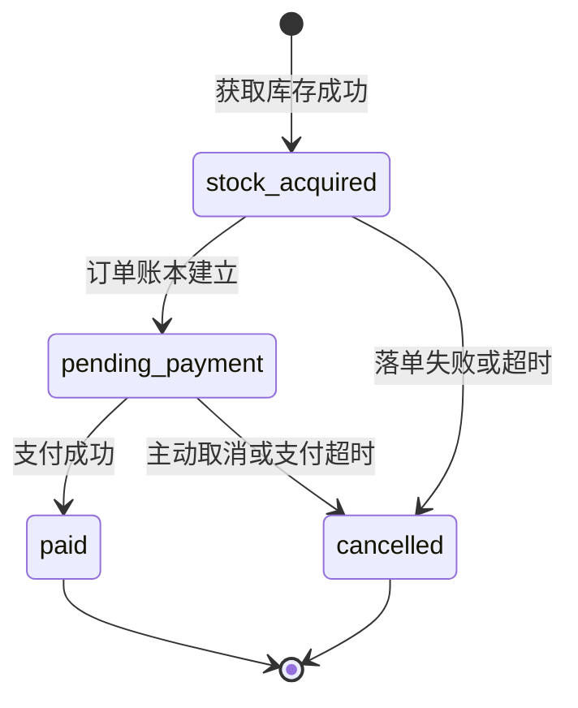

# Silas · 高并发架构故事书

这不是把 Redis、MySQL、RocketMQ 全部堆在一张图上的“技术陈列柜”。项目会像一本故事书一样，一章只提出一个问题，再用可重复的真实实验让架构自己回答。

当前完成的是第一章：

> **那本不该被翻烂的《百职录》**
>
> 当几千个人反复询问同一份材料聚合详情，为什么“每次都 JOIN 与聚合 MySQL”这条诚实的旧规矩会失效？Cache-Aside 又究竟替系统挡住了什么？

首页不会提前展示库存、订单或 MQ。第一章只讲读取；写入竞争会在后续章节登场。

## 第一章怎么玩

页面采用逐幕推进：后续章节入口默认锁定，必须先真正翻阅一页档案、让旧路径承受请求、再让缓存路径交出数据，故事才会继续。原生长滚动条被隐藏，页首进度与桌面端章节罗盘只负责标记已经走过的路，不能提前跳过实验。

启动完整环境：

```bash
docker compose up -d --build
```

打开：

```text
http://localhost:5678/
```

### Windows / macOS 压测兼容

`docker/wrk2/Dockerfile` 会读取 Docker BuildKit 提供的 `TARGETARCH`，不需要手动指定 `--platform`：

- `amd64`（常见 Windows、Intel Mac）构建 wrk2 主线版本；
- `arm64`（Apple Silicon Mac、Windows on ARM）构建 AArch64 兼容版本。

仓库通过 `.gitattributes` 强制 Shell 和 Lua 脚本使用 LF，避免 Windows 的 CRLF 让 Linux 容器入口启动失败。首次构建 wrk2 需要下载编译工具链；Dockerfile 会按 CPU 架构隔离 apt 缓存，并对镜像源的临时 5xx 和中断下载自动重试。

然后按页面顺序完成四件事：

1. 从市场选择一种材料。基础列表保持轻量，进入实验室后读取聚合详情。
2. 复制“旧规矩”压测指令到项目终端，观察 SQL 查询数、QPS、P99 和连接池峰值。
3. 唤醒 Redis 记忆水晶。第一次查询真实发生 `MISS -> 4 SQL -> SET DTO`，后续直接命中最终 JSON。
4. 使用相同压力运行第二条指令，查看每千请求 SQL 查询数的归一化对比。

推荐从页面默认的 `300 req/s` 开始，再按 `500 -> 1000 req/s` 阶梯寻找本机拐点；目标速率不是并发连接数，页面生成的命令固定使用 96 个连接。

重新讲述本章时，点击页脚的“合拢书本，重新讲述”。它只会清空：

- `archive:material-detail:v1:*` Redis 最终 DTO 缓存；
- 第一章的直读与缓存读指标。

它不会删除秒杀订单，也不会改动任何库存。

## 这次对比为什么成立

两轮实验固定：

| 不变量 | 内容 |
|---|---|
| 业务语义 | 读取同一份材料聚合详情 |
| 权威数据 | MySQL 材料基础、组成、交易与评分表 |
| HTTP 响应体 | 完全相同的 JSON |
| 压测工具 | wrk2 固定 QPS |
| 速率、时长、连接数 | 页面同时更新两条命令 |

唯一变量是读取路径：

```text
旧规矩
Browser / wrk2 -> Go API -> MySQL

记忆水晶
Browser / wrk2 -> Go API -> Redis
                            ├─ HIT  -> 返回
                            └─ MISS -> MySQL -> 回填 Redis -> 返回
```

因此第一章没有再把 Cache-Aside 塞进秒杀库存方案里。缓存优化的是“它是什么”这类可重复读取；它不负责裁决“最后一件库存属于谁”。

## 真实指标与故事隐喻

页面没有伪造流量。故事中的每个变化都由服务端指标触发：

| 故事语言 | 技术指标 |
|---|---|
| 赶来的访客 | HTTP `totalRequests` |
| 真本查询次数 | MySQL `sqlQueries`（兼容字段 `dbReads` 同值） |
| 每秒问询 | 最近请求桶计算的 `qps` |
| 99% 回答不超过 | `p99` 端到端延迟 |
| 长廊最高占用 | MySQL pool peak / capacity |
| 水晶回答 | Redis cache hit |
| 水晶遗忘 | Redis cache miss |
| 真本磨损、书脊裂开 | 由真实 MySQL 读取次数跨过阈值后触发的叙事表现 |

指标只保留有界延迟样本，不逐请求写日志。GORM 默认只记录慢查询和错误，避免压测再次制造 GB 级 SQL 日志。

## 第一章 API

| 路径 | 方法 | 说明 |
|---|---|---|
| `/api/archives` | GET | 材料基础列表；不计入对比指标 |
| `/api/archives/:id/direct` | GET | 每次执行 4 条 SQL 组装聚合详情 |
| `/api/archives/:id/cached` | GET | Redis Cache-Aside 读取最终 DTO |
| `/api/chapters/cache-aside/reset` | POST | 清缓存并重置本章指标 |
| `/api/metrics/snapshot` | GET | 全部服务端指标快照，含 `archiveRead` |
| `/api/metrics/stream` | GET | SSE 实时指标流 |

两条详情接口的响应体相同，只通过响应头解释数据来源：

```text
X-Read-Path: mysql-direct | cache-aside
X-Archive-Source: mysql | redis-miss | redis-hit | redis-fallback
X-SQL-Queries: 0 | 1..4
```

缓存 key 与边界：

```text
key: archive:material-detail:v1:{id}
TTL: 300s
权威源: MySQL material_catalog / material_components / material_trades / material_reviews
```

同进程冷启动并发通过双检互斥合并回源，避免第一波 MISS 放大成缓存击穿。Redis 故障时请求降级回源 MySQL：缓存可以失去，真本不能失去。

## 书页背后的完整项目

第一章之外，后端仍保留两套统一订单生命周期的秒杀写路径，供后续章节逐步揭示：

- **方案 A：MySQL 权威库存同步准入**；
- **方案 B：Redis 原子准入 + RocketMQ 普通消息异步落单 + MySQL 最终账本**。

统一生命周期：



两个写模式的当前 API：

| 路径 | 方案 |
|---|---|
| `GET /lucky/cacheaside` | 历史路径名；实际是 MySQL 权威库存同步扣减 |
| `GET /lucky` | Redis Lua 准入 + RocketMQ 异步落单 |
| `GET /api/order/status` | 查询统一订单状态 |
| `POST /pay` | `pending_payment -> paid` |
| `POST /giveup` | 非终态 `-> cancelled` |
| `POST /api/lab/reset` | 重置完整秒杀实验 |

`/lucky/cacheaside` 会在后续章节改成语义清楚的新路径；当前保留它是为了不破坏已有调用。它不再出现在第一章页面，也不再被解释成“缓存库存方案”。

## RocketMQ 在后续章节的职责

| Topic | 类型 | 职责 |
|---|---|---|
| `CREATE_ORDER` | 普通消息 | Redis 准入后异步创建 MySQL 待支付订单，缓冲数据库写峰值 |
| `CANCEL_ORDER` | 延迟消息 | 支付窗口到期后触发状态检查和库存释放 |

普通消息使用的是主流 MQ 共有的异步解耦、缓冲削峰和至少一次投递语义；延迟取消才使用 RocketMQ 的延迟消息能力。

## 章节路线

```text
第一章  那本不该被翻烂的《百职录》
        Cache-Aside：重复读如何离开 MySQL 热路径

第二章  当一千只手伸向最后一枚星印
        MySQL 条件扣减：权威库存如何同步裁决

第三章  城门只发放资格，不再当场誊写订单
        Redis Lua + MQ：准入、削峰、异步落单

第四章  两封迟到的信与一份不能复活的订单
        至少一次投递、幂等、超时取消与状态机
```

## 代码结构

```text
internal/app            依赖装配、启动和优雅退出
internal/router         页面与 API 路由
internal/handler        HTTP 协议适配
internal/service        读取编排、抽奖、支付和取消业务流程
internal/database       MySQL / Redis 数据访问与 Lua 原子脚本
internal/mq             RocketMQ producer / consumer
internal/metrics        有界内存指标、快照与 SSE 数据源
views/                  故事书页面与支付页
docker/wrk2             固定 QPS 压测工具和 Lua 请求脚本
docs/                   状态机与可靠性边界
```

## 验证

```bash
go test ./...
go vet ./...
docker compose config --quiet
```

订单和消息可靠性边界详见 [docs/reliability.md](docs/reliability.md)。
