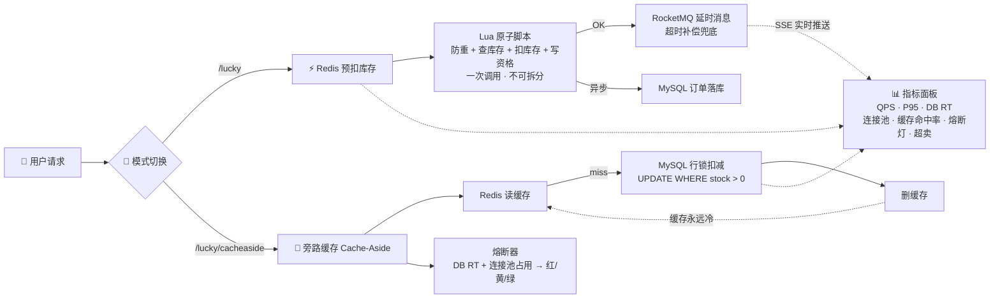
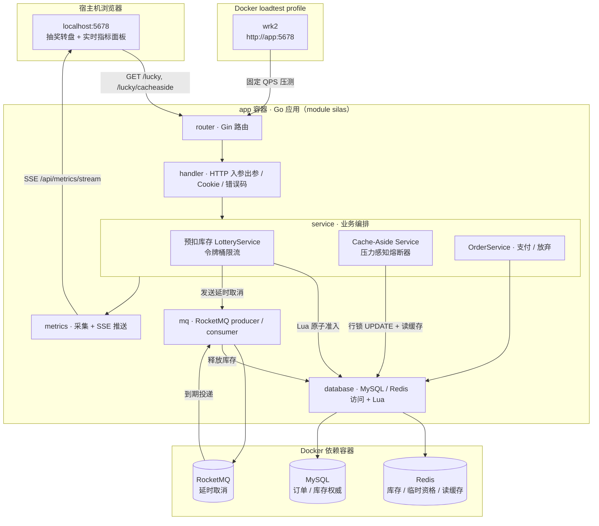
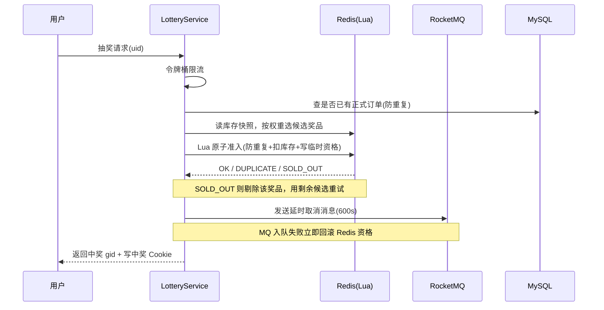
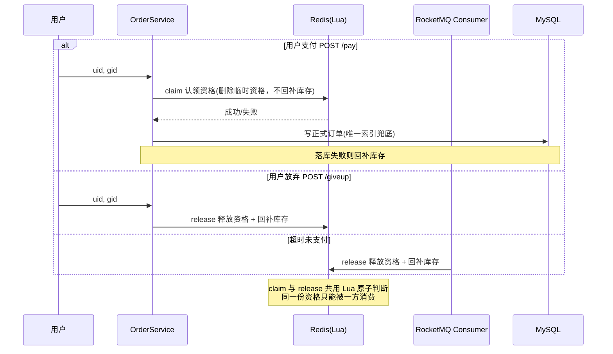

# Silas · 高并发秒杀 / 抽奖架构对比实验台

> 同一个抽奖业务，两套库存方案，一键切换，同一把压测尺子——用实时数据看它们在高并发下到底差在哪。

## 它解决什么问题

秒杀 / 抽奖类业务的入口，本质是**高并发写库存**。同样是扣库存，业界有两种主流方案——

- **Redis 预扣库存**：库存放 Redis，Lua 原子扣减，快、稳，一致性靠 MQ 补偿。
- **旁路缓存 Cache-Aside**：MySQL 行锁扣减，强一致、绝不超卖，但**高并发写会让缓存频繁击穿，请求直打数据库，慢到系统不可用**。

这两种方案分别代表了「用一致性换性能」和「用性能换一致性」两种哲学。但大部分讨论只停在理论——到底差多少？在什么 QPS 下开始扛不住？能不能自愈？

本项目把它们实现在同一个抽奖场景下，共享同一张库存表、跑同一套压测，用一块实时指标面板把这些「光看文章答不出」的问题，变成可复现的数据。

## 核心亮点

- **Redis Lua 原子准入**：把「防重复参与 + 查库存 + 扣库存 + 写临时资格」绑定进单个 Lua 脚本，彻底消灭「查的时候有、扣的时候没了」的经典竞态，只返回 `OK / DUPLICATE / SOLD_OUT` 三态。
- **RocketMQ 延时补偿**：抢到资格但超时未支付，靠延时消息把库存悄悄还回 Redis；支付、主动放弃、超时释放三条路径共用同一份临时资格作为并发边界，保证同一份库存只被消费一次。
- **压力感知熔断器**：不看错误率，而是盯 **DB 响应时间 + 连接池占用率**，三态机（Closed/Open/Half-Open）在过载时 fail-fast 保护 MySQL，冷却后自动试探恢复。
- **可观测**：SSE 一秒一推的实时面板——QPS、P95/P99、DB 响应、连接池占用、缓存命中率、熔断器信号灯、是否超卖，全程可见；前端会记录压测快照，支持回放、暂停和拖动关键帧。
- **工程化细节**：优雅退出（信号驱动、按序释放依赖）、启动自愈建表（老数据卷自动补齐订单唯一索引与 `cache_stock` 列）、清晰分层（handler / service / database 边界严格）、结构化日志 + 业务错误码 + HTTP 状态码 + 指标四位一体。

---

## 目录

- [核心功能](#核心功能)
- [技术栈](#技术栈)
- [系统架构](#系统架构)
- [核心业务流程](#核心业务流程)
- [关键设计说明](#关键设计说明)
- [本地启动](#本地启动)
- [环境变量说明](#环境变量说明)
- [API 概览](#api-概览)
- [部署说明](#部署说明)
- [项目状态与 Roadmap](#项目状态与-roadmap)
- [目录结构](#目录结构)

---

## 核心功能

### 库存模式对决（项目主线）

| 维度 | 预扣库存（`/lucky`） | 旁路缓存 Cache-Aside（`/lucky/cacheaside`） |
| :--- | :--- | :--- |
| 库存权威源 | Redis（`gift_count_{id}`） | MySQL（`inventory.cache_stock` 列） |
| 读路径 | 直接读 Redis 库存当权重 | 先读 Redis 聚合缓存，未命中回源 MySQL 回填 |
| 写路径 | Redis Lua 原子扣减 | MySQL 行锁 `UPDATE ... WHERE cache_stock>0` 后删缓存 |
| 一致性 | 最终一致（MQ 补偿 + 超时释放） | 强一致，**绝不超卖** |
| 落库时机 | 支付后异步写 `orders` | 扣减成功后直接写 `orders`（纯 DB 强一致路径） |
| 入口保护 | 令牌桶限流 | 压力感知熔断器 |
| 高并发表现 | Redis 扛住，平稳、快 | 每次写打 MySQL，行锁竞争 + 连接池排队，慢、DB 是瓶颈 |

两个模式**共享同一张 `inventory` 表但读写不同列**，页面左上角一键切换——这把「尺子」是绝对公平的。

### 秒杀主链路

- **权重抽奖算法**：按各奖品的实时剩余库存动态计算中奖概率，库存越多越容易抽中，目标是把奖品尽量发完。
- **临时资格 → 正式订单**：抽中先拿「待支付临时资格」（Redis），支付时认领资格并写 MySQL 正式订单；超时或放弃则回补库存。
- **重复参与防护**：MySQL 侧 `uk_activity_user(activity_id, user_id)` 唯一索引 + Redis Lua 的资格存在性判断双重兜底。

### 可靠性与降级

- **延时取消补偿**：RocketMQ `CANCEL_ORDER` 延时 Topic，支付窗口（默认 600s）到期后消费者释放悬挂库存。
- **失败回滚兜底**：MQ 入队失败、奖品详情查询失败、正式订单落库失败等场景，立即回补已扣库存，不让库存长期悬挂。
- **过载保护**：Cache-Aside 链路用「受限并发闸门」模拟连接池 + 压力感知熔断器，过载 fail-fast，冷却后自愈。

### 观测与压测

- **实时指标面板**：SSE 推送两套模式的独立指标（见 [API 概览](#api-概览)）。
- **内置 wrk2 压测**：Docker Compose `loadtest` profile 一条命令固定 QPS 施压，脚本自动为每个请求追加不同 `uid`。

---

## 技术栈

| 分类 | 选型 | 说明 |
| :--- | :--- | :--- |
| 语言 | Go 1.25（module `silas`） | 入口 `main.go` 仅负责启动，装配集中在 `internal/app` |
| Web 框架 | Gin | 路由 / 静态资源 / HTML 模板 |
| ORM | GORM + `driver/mysql` | 只写最终订单，不参与入口高并发扣库存 |
| 缓存 | Redis（go-redis v6） | 预扣库存权威源 / Cache-Aside 读缓存，Lua 原子脚本 |
| 消息队列 | Apache RocketMQ 5（golang client v5） | 延时取消消息，超时释放库存 |
| 配置 | Viper（`conf/*.yaml`） + 环境变量覆盖 | 环境变量优先，便于容器化 |
| JSON | bytedance/sonic | 高性能序列化 |
| 日志 | `log/slog` + file-rotatelogs | 结构化日志，按文件切割 |
| 前端 | 原生 HTML/CSS/JS + [lucky-canvas](https://100px.net/usage/js.html) | 抽奖转盘 + SSE 实时面板 |
| 基础设施 | Docker Compose（Go app / MySQL 8.4 / Redis 7 / RocketMQ 5.3.2） | 应用与依赖同跑 Docker 网络，避免 MQ 地址广播问题 |
| 交付 | 多阶段 Dockerfile（非 root 运行） | Compose 默认构建并启动 app 容器 |
| 压测 | wrk2（Compose `loadtest` profile） | 固定 QPS 恒定压力 |

---

## 极简架构图

> 两种方案唯一的变量就是**库存扣减**这一步。看懂这张图，就抓住了整个项目的骨架。

**Redis 预扣库存（`/lucky`）**：入口请求先抢“临时资格”，不直接写最终订单。服务会先做幂等查询，再把库存扣减、防重复参与、写入临时资格这几个动作交给 Redis Lua 一次性完成。Lua 在 Redis 内部原子执行，所以高并发下不会出现两个请求同时扣到同一份库存。拿到资格后，系统发送 RocketMQ 延时消息；用户支付才写 MySQL 正式订单，超时未支付则由 MQ 消费者释放临时资格并回补库存。这个方案的优势是入口吞吐高、MySQL 不承接库存扣减热写；代价是系统从“单次数据库事务”变成“Redis + MQ + MySQL 协作的最终一致”，必须依赖 Lua 原子性、MQ 补偿、MySQL 幂等、Redis 持久化和对账机制共同兜底。

**旁路缓存 Cache-Aside（`/lucky/cacheaside`）**：MySQL 是库存权威源，Redis 只是库存快照的读缓存。请求会先读 Redis 聚合库存缓存；未命中时回源 MySQL 并回填缓存，再根据库存权重抽取候选奖品。真正扣库存时，系统不会相信缓存里的库存值，而是走 MySQL 条件更新和行锁：`UPDATE ... SET cache_stock = cache_stock - 1 WHERE cache_stock > 0`。这样即使多个请求同时读到同一份旧缓存，最后也只能由 MySQL 串行扣减，库存大于 0 的请求成功，库存不足的请求失败，所以它强一致、不超卖。代价是秒杀/抽奖属于高并发写库存，每次扣减成功后都要删除 Redis 缓存，下一批请求又容易回源 MySQL；同时大量请求会集中争抢同一批热点库存行。行锁保证了正确性，但也会把并发请求变成排队请求：等锁、占连接、拖慢响应，连接池被打满后 DB P95/P99 会迅速升高。压测时如果看到缓存命中率下降、回源/DB 操作次数上升、连接池占用升高、DB P95/P99 变高，就说明压力已经回落到 MySQL。继续放请求只会扩大排队和超时，所以系统会触发压力感知熔断器，直接 fail-fast 拒绝新请求，保护 MySQL 不被拖死。



| 节点 | 预扣库存 | 旁路缓存 |
|:---|:---|:---|
| 库存权威源 | Redis | MySQL |
| 扣减方式 | Lua 原子脚本 | MySQL 行锁 |
| MySQL 参与时机 | 支付后异步写订单 | **每次扣减都打** |
| 缓存角色 | Redis 就是权威源 | Redis 是读缓存（写密集下永远冷） |
| 保护机制 | 令牌桶限流 | 压力感知熔断器 |
| 一致性 | 最终一致（MQ 补偿） | 强一致（行锁保证） |

---

## 系统架构（详细）

项目默认全容器化运行：浏览器从宿主机访问 `localhost:5678`，wrk2、Go app、MySQL、Redis、RocketMQ 都在同一个 Docker Compose 网络里通信。这样 RocketMQ 返回给 SDK 的 `rocketmq-broker:8081`、MySQL 的 `mysql:3306`、Redis 的 `redis:6379` 都是容器内可解析地址，不会再出现半容器化下的网络绕路问题。



**数据流要点**：

- 预扣模式的高并发库存扣减**全压在 Redis Lua**，MySQL 承担幂等性校验（SELECT 查已有订单）+ 支付后写最终订单；Cache-Aside 模式**每次扣减都打 MySQL 行锁**，Redis 只做读缓存。
- 抽奖成功即向 RocketMQ 投递一条延时消息；用户支付则认领资格、消息到期后成为空操作，用户不支付则消息到期后回补库存。
- `metrics` 层旁路采集，不参与主链路事务，通过 SSE 单向推送给前端。

---

## 核心业务流程

### 1. 预扣库存抽奖（`GET /lucky`）



### 2. 支付 / 放弃 / 超时释放（三路共用同一份资格）



### 3. Cache-Aside 抽奖（`GET /lucky/cacheaside`）

1. 熔断器入口判断，过载则 **fail-fast** 拒绝，保护 MySQL。
2. 查 MySQL 正式订单防重复。
3. Cache-Aside 读全部库存：命中 Redis 聚合缓存直接用，未命中回源 MySQL 回填（TTL 2s）。
4. 按库存权重选候选，**MySQL 行锁 `UPDATE ... WHERE cache_stock>0`** 原子扣减（绝不超卖）。
5. 扣减成功后**直接写正式订单**（强一致，不走临时资格与 MQ 补偿）；失败则回补库存。
6. 每次真正打 DB 的操作上报耗时与连接池占用，驱动熔断器状态切换。

### 4. 库存初始化与自愈

- 启动时 `EnsureOrderSchema` / `EnsureCacheStockSchema` 自动补齐订单唯一索引和 `cache_stock` 列——老数据卷不重跑 `init.sql` 也能正常运行。
- 从 MySQL `count` 恢复 Redis 库存基线，并区分「活动初始库存」与「Redis 当前可用库存」建立指标基线，避免重启后把剩余库存误判为初始库存。

---

## 关键设计说明

### 数据模型

- **`inventory`（奖品库存表）**：`count` 作为预扣模式的**只读初始库存基线**（重启据此恢复 Redis）；`cache_stock` 是 Cache-Aside 模式的**独立实时库存列**。两个模式共享一张表、读写不同列，彻底隔离。
- **`orders`（订单表）**：`uk_activity_user(activity_id, user_id)` 唯一索引是「同一活动同一用户只能中一次」的最终防线。
- **Redis key 约定**：`gift_count_{id}`（预扣库存）、`porder_{uid}`（用户临时资格，值为 giftID）、`gift_cache_all_stock`（Cache-Aside 聚合库存 JSON 缓存，TTL 2s）。

> **为什么这样设计**：把「高并发扣库存」和「最终订单落库」分离到 Redis 与 MySQL 两层，让数据库不参与入口洪峰；两模式共享表却隔离列，保证对比实验的变量唯一（只有库存扣减方式不同）。

### 权限 / 资格控制

秒杀资格不是简单的「库存数字」，而是「防重复 + 扣库存 + 写临时资格」三个状态变化的组合。**Redis Lua 脚本是唯一的原子边界**——绝不退化为多条普通 Redis 命令，否则高并发下会出现「两个请求同时通过库存检查」的超卖或重复资格。支付认领（claim）、主动放弃与超时释放（release）共用同一份临时资格判断，天然具备竞态安全性。

### 消息与补偿设计

延时取消消息的 `delay` 与临时资格 TTL、支付 Cookie 过期时间统一为 `PayDelaySeconds`（默认 600s），三者一致才能保证「资格过期」「补偿触发」「前端倒计时」同步。**TTL 过期只删资格、不自动回补库存**——回补必须由 MQ 消费者或失败回滚显式完成，避免库存悬挂被回补两次。

### 照片 / 可见范围等业务

> 待补充：本项目为秒杀/抽奖架构实验台，不涉及照片、可见范围、聊天等业务模块。

### 部署设计

**Go app 与依赖统一跑在 Docker Compose 网络里**是默认结构——Compose 会构建 `app` 镜像，启动 MySQL、Redis、RocketMQ，并通过一次性 `rocketmq-init` 自动创建延时 Topic。这样应用访问 MQ / DB / Redis 都使用容器内服务名，避免“Go 在宿主机、MQ 在容器里”导致的地址广播和 gRPC 连接问题。所有配置项均可通过环境变量覆盖，默认 Compose 配置无需手改即可跑通。

---

## 本地启动

### 环境要求

- Docker / Docker Compose
- （可选）Go 1.25+，仅在本机直接跑测试或调试源码时需要
- （可选）压测无需额外安装，内置 wrk2 容器

### 快速启动

默认启动会同时启动 Go app、MySQL、Redis、RocketMQ，并等待数据库健康和 RocketMQ Topic 初始化完成。**所有配置都有默认值，无需手动设环境变量。**

```bash
# 构建并启动完整实验台
docker compose up -d --build app
```

启动后打开 <http://localhost:5678/>。左上角可一键切换库存模式，右侧面板会通过 SSE 展示真实后端指标。

> `app` 容器监听 `0.0.0.0:5678`，宿主机通过端口映射访问 `localhost:5678`。容器内应用访问依赖时使用 `mysql:3306`、`redis:6379`、`rocketmq-broker:8081`。

### 压测对比

```bash
# 预扣模式基准（默认压 /lucky，500 QPS 30s）
docker compose --profile loadtest run --rm wrk2

# 预扣模式：自定义参数
docker compose --profile loadtest run --rm \
  -e RATE=1000 -e DURATION=60s -e CONNECTIONS=256 wrk2

# Cache-Aside 模式：目标路径改为 /lucky/cacheaside
docker compose --profile loadtest run --rm \
  -e TARGET_URL=http://app:5678/lucky/cacheaside \
  -e RATE=1000 -e DURATION=60s -e CONNECTIONS=256 wrk2
```

录制演示时不建议一上来就打 1000 QPS，否则 Cache-Aside 会瞬间进入熔断，动态过程不够好讲。更适合用阶梯压测观察压力传导：

```bash
# 0. 环境校准：确认 reset、SSE、wrk2 和 app 都是干净状态
docker compose --profile loadtest run --rm \
  -e TARGET_URL=http://app:5678/lucky/cacheaside \
  -e RATE=50 -e DURATION=20s -e CONNECTIONS=32 wrk2

# 1. 低压基线：确认旁路缓存链路正常
docker compose --profile loadtest run --rm \
  -e TARGET_URL=http://app:5678/lucky/cacheaside \
  -e RATE=150 -e DURATION=20s -e CONNECTIONS=64 wrk2

# 2. 中压加压：观察缓存命中率下降、库存回源查询增加
docker compose --profile loadtest run --rm \
  -e TARGET_URL=http://app:5678/lucky/cacheaside \
  -e RATE=300 -e DURATION=25s -e CONNECTIONS=96 wrk2

# 3. 高压逼近：观察连接池占用和 MySQL P95/P99 上升
docker compose --profile loadtest run --rm \
  -e TARGET_URL=http://app:5678/lucky/cacheaside \
  -e RATE=600 -e DURATION=25s -e CONNECTIONS=160 wrk2

# 4. 极限击穿：观察熔断器 fail-fast 保护 MySQL
docker compose --profile loadtest run --rm \
  -e TARGET_URL=http://app:5678/lucky/cacheaside \
  -e RATE=1000 -e DURATION=30s -e CONNECTIONS=256 wrk2
```

Cache-Aside 会真实扣减 MySQL 的 `cache_stock` 并写正式订单；重复压测前建议重置库存：

```sql
UPDATE inventory SET cache_stock = count;
```

### 常用命令

```bash
docker compose ps                        # 查看 app 和依赖状态
docker compose logs -f app               # Go app 日志
docker compose logs -f rocketmq-broker   # RocketMQ 日志
docker compose restart app               # 只重启 Go app 容器
docker compose down                      # 停止全部容器，保留数据卷
docker compose down -v                   # 停止全部容器并清数据（下次启动重新建表）
```

### 常见问题

- **RocketMQ 起得慢**：Broker 就绪需要十几秒，`rocketmq-init` 会重试建 Topic；压测/演示前先 `docker compose ps` 确认健康。
- **改了 Go / HTML / JS / CSS 后没生效**：Go 和前端静态资源会被打进 `app` 镜像，执行 `docker compose up -d --build app` 重新构建启动；如果只想重启当前镜像，用 `docker compose restart app`。
- **Cache-Aside 压不出红灯**：调小 `LOTTERY_CACHEASIDE_DB_CONCURRENCY`（模拟连接池），或压测前重置 `cache_stock`。
- **重复压测数据不对**：Cache-Aside 会真实扣减 MySQL，每轮压测前执行上面的重置 SQL。

---

## 环境变量说明

均为可选，未设置时回落到 `conf/*.yaml` 或内置默认值。示例用占位符，请勿提交真实密钥。

| 变量 | 默认值 | 说明 |
| :--- | :--- | :--- |
| `LOTTERY_HTTP_ADDR` | `localhost:5678` | Web 监听地址 |
| `LOTTERY_MYSQL_HOST` | `conf/mysql.yaml` | MySQL 主机 |
| `LOTTERY_MYSQL_PORT` | `3306` | MySQL 端口 |
| `LOTTERY_MYSQL_USER` | `conf/mysql.yaml` | MySQL 用户 |
| `LOTTERY_MYSQL_PASSWORD` | `<your-password>` | MySQL 密码 |
| `LOTTERY_MYSQL_DATABASE` | `lottery` | 数据库名 |
| `LOTTERY_REDIS_ADDR` | `conf/redis.yaml` | Redis 地址 |
| `LOTTERY_REDIS_PASSWORD` | `<your-password>` | Redis 密码 |
| `LOTTERY_REDIS_DB` | `conf/redis.yaml` | Redis DB 编号 |
| `LOTTERY_MQ_ENABLED` | `true` | 是否启用 RocketMQ 延时取消 |
| `LOTTERY_MQ_ENDPOINT` | `localhost:8081` | RocketMQ Proxy Endpoint |
| `LOTTERY_MQ_TOPIC` | `CANCEL_ORDER` | 取消订单 Topic |
| `LOTTERY_MQ_CONSUMER_GROUP` | `lottery` | 消费者组 |
| `LOTTERY_COOKIE_DOMAIN` | `localhost` | Cookie 域名 |
| `LOTTERY_RATE_LIMIT_QPS` | `0` | `/lucky` 令牌桶限流（每秒令牌数），`0` 关闭；本机脚本默认 `800` |
| `LOTTERY_CACHEASIDE_DB_CONCURRENCY` | `10` | Cache-Aside 打到 MySQL 的并发上限（模拟连接池） |
| `LOTTERY_CB_YELLOW_LATENCY_MS` | `30` | DB 响应预警黄线（毫秒） |
| `LOTTERY_CB_RED_LATENCY_MS` | `150` | DB 响应熔断红线（毫秒） |
| `LOTTERY_CB_RED_POOL_USAGE` | `95` | 连接池占用率熔断红线（%）；单独打满只预警，需叠加延迟升高才熔断 |
| `LOTTERY_CB_TRIP_THRESHOLD` | `12` | 连续过载多少次触发熔断 |
| `LOTTERY_CB_COOLDOWN_MS` | `5000` | 熔断到 Half-Open 的冷却时间（毫秒） |
| `LOTTERY_CB_HALFOPEN_MAX` | `5` | Half-Open 最多放行的试探请求数 |
| `LOTTERY_CB_HALFOPEN_SUCCESS` | `3` | Half-Open 连续健康多少次才恢复 Closed |
| `LOTTERY_LOG_LEVEL` | `info` | 日志级别 |

---

## API 概览

### 页面与静态资源

| 路径 | 方法 | 说明 |
| :--- | :--- | :--- |
| `/` | GET | 抽奖转盘页 |
| `/result` | GET | 支付结果页 |
| `/js` `/css` `/img` | GET | 静态资源 |

### 业务接口

| 路径 | 方法 | 参数 | 说明 |
| :--- | :--- | :--- | :--- |
| `/gifts` | GET | — | 返回全部奖品，用于转盘填充 |
| `/lucky` | GET | `uid`（可选） | 预扣库存模式抽奖，返回中奖 gid（无库存返回 `0`） |
| `/lucky/cacheaside` | GET | `uid`（可选） | 旁路缓存模式抽奖，协议同上 |
| `/pay` | POST | `uid`, `gid` | 认领临时资格并写正式订单 |
| `/giveup` | POST | `uid`, `gid` | 放弃并回补库存 |

> `uid` 优先取 query 参数，其次 `X-User-ID` 头；浏览器手动点击无 uid 时自动生成临时用户 ID。服务端始终以 Redis `porder_{uid}` 为可信资格来源，不信任前端 Cookie。

### 指标接口

| 路径 | 方法 | 说明 |
| :--- | :--- | :--- |
| `/api/metrics/snapshot` | GET | 返回当前指标快照（JSON） |
| `/api/metrics/stream` | GET | SSE 实时推送指标 |

**预扣模式指标**：活动库存 / Redis 库存 / 总请求 / 入队成功 / 限流数 / 库存不足 / MQ 待消费 / 完成订单 / 平均·P95·P99·最大延迟 / QPS / 是否超卖。

**Cache-Aside 指标**：QPS / 完成 / 售罄 / 熔断拒绝 / 缓存命中·未命中·命中率 / DB 平均·P95·最大延迟 / 连接池占用（数·容量·百分比）/ 熔断器信号灯（green·yellow·red）。

---

## 部署说明

### Compose 服务

`docker-compose.yml` 启动 Go app、MySQL、Redis、RocketMQ（NameServer + Broker + Proxy）和可选 wrk2 压测容器。`rocketmq-init` 是一次性任务，会自动创建 `CANCEL_ORDER` 延时 Topic 与消费者组；MySQL 首次启动自动执行 `init.sql`。

### 应用交付

- **默认方式**：`docker compose up -d --build app`。Compose 会构建多阶段 `Dockerfile`，并用容器内环境变量连接 `mysql`、`redis`、`rocketmq-broker`。
- **单独构建镜像**：运行阶段基于 `alpine`，以非 root 用户 `lottery` 启动，暴露 `5678`：

  ```bash
  docker build -t silas-lottery .
  docker run -p 5678:5678 --env-file .env silas-lottery
  ```

  > 单独 `docker run` 时要自己提供 MySQL、Redis、RocketMQ 地址；本项目推荐直接使用 Compose，避免 MQ 地址广播和容器网络配置不一致。

### CI/CD

> 暂无。当前仓库未包含 GitHub Actions / SSH / rsync 等自动化部署链路。可作为后续 Roadmap 项补充。

---

## 项目状态与 Roadmap

### 已完成

- ✅ 预扣库存与 Cache-Aside 两套模式，页面一键切换、同场景对比
- ✅ Redis Lua 原子准入 / 释放 / 认领三脚本
- ✅ RocketMQ 延时取消补偿 + 支付/放弃/超时释放竞态安全
- ✅ 压力感知熔断器（三态机）+ 受限并发闸门
- ✅ SSE 实时指标面板（双模式独立指标）
- ✅ 启动自愈建表、优雅退出、结构化日志 + 业务错误码 + 指标
- ✅ 内置 wrk2 固定 QPS 压测

### 后续可优化方向

- ⬜ CI/CD：GitHub Actions 构建 + 镜像发布 + 自动化部署链路
- ⬜ 分布式部署下的指标聚合（当前为单实例内存指标）
- ⬜ 压测报告归档与两模式基准数据可视化对比
- ⬜ 熔断 / 限流参数的运行时热更新
- ⬜ 更完整的单元测试与集成测试覆盖

---

## 目录结构

```text
.
├── main.go                     # 进程入口，仅 app.New().Run()
├── init.sql                    # 库表初始化（inventory / orders）
├── docker-compose.yml          # Go app / MySQL / Redis / RocketMQ / wrk2
├── Dockerfile                  # 多阶段构建，非 root 运行
├── conf/                       # mysql.yaml / redis.yaml 基础配置
├── internal/
│   ├── app/                    # 依赖装配、HTTP Server、优雅退出、启动自愈
│   ├── router/                 # Gin 路由与静态资源注册
│   ├── handler/                # HTTP 入参出参、Cookie、错误码、SSE
│   ├── service/                # 抽奖(预扣/Cache-Aside)、支付、限流、熔断器
│   ├── database/               # MySQL/Redis 访问、Lua 脚本、库存与订单
│   ├── mq/                     # RocketMQ producer / consumer
│   ├── metrics/                # 指标采集与快照（双模式）
│   └── util/                   # 配置、日志、抽奖算法、环境变量工具
├── views/                      # 前端页面（转盘 + 实时面板，lucky-canvas）
├── docker/                     # RocketMQ broker 配置、wrk2 镜像与脚本
├── scripts/                    # Windows PowerShell 启动/压测脚本
└── docs/                       # 本地开发、可靠性说明等文档
```

> 更详细的分层与链路可靠性说明见 [docs/reliability.md](docs/reliability.md) 与 [docs/local-dev.md](docs/local-dev.md)。
