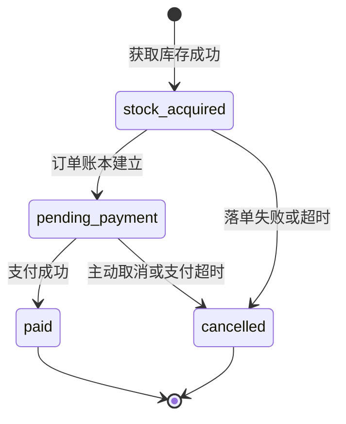

# Silas · 高并发秒杀架构演示项目

这个项目用同一个订单生命周期，展示两种完整交易写路径：

- **方案 A：MySQL 权威库存同步准入**
- **方案 B：Redis 原子准入 + RocketMQ 异步落单 + MySQL 最终账本**

项目不再把“Redis 预扣”和“库存 Cache-Aside”包装成单变量公平实验。A/B 是两套完整架构策略；如果要严格归因 Redis 或 MQ 的单独收益，应另外拆分实验。

## 统一订单生命周期



核心约束：

- `paid` 和 `cancelled` 是互斥终态。
- 订单最多占用一次库存、最多回补一次库存。
- 重复请求和重复消息只能幂等返回，不能覆盖终态。
- 迟到的创建消息不能执行 `cancelled -> pending_payment`。
- 支付后取消属于退款业务，需要新增状态，不能复用 `cancelled`。

## 两种方案

| 维度 | 方案 A：MySQL 同步 | 方案 B：Redis + MQ 异步 |
|---|---|---|
| 入口 | `GET /lucky/cacheaside` | `GET /lucky` |
| 实时库存权威 | MySQL `inventory.cache_stock` | Redis `gift_count_{id}` |
| 获取库存 | MySQL 条件更新 | Redis Lua |
| 待支付订单 | 请求事务内同步建立 | `CREATE_ORDER` 普通消息异步建立 |
| 订单最终账本 | MySQL `orders` | MySQL `orders` |
| 支付超时 | `CANCEL_ORDER` 延迟消息 | `CANCEL_ORDER` 延迟消息 |
| 入口成功状态 | `pending_payment` | `stock_acquired` |
| 主要瓶颈 | 热点行、连接池、事务延迟 | Redis/MQ 可用性、消息积压、最终一致性 |

两个模式固定以下业务语义：

- 同一活动一人一单。
- 相同支付窗口。
- 相同 `pending_payment -> paid/cancelled` 状态定义。
- 相同支付、主动取消、超时取消接口。
- 取消后原订单不能复活或重新参与。

## 方案 A：MySQL 权威库存同步准入

```text
请求
-> 读取候选库存
-> MySQL 显式事务
   -> UPDATE cache_stock WHERE cache_stock > 0
   -> INSERT orders(status=pending_payment, inventory_mode=mysql)
-> 发送 CANCEL_ORDER 延迟检查
-> 返回待支付
```

库存扣减和待支付订单处于同一事务：任一步失败都会整体回滚。支付和取消都以 `status = pending_payment` 为前置条件；取消获胜时，状态更新和库存回补仍在同一事务。

当前 `gift_cache_all_stock` 只用于读取候选权重。它不是库存正确性机制：即使读到旧值，真正准入仍由 MySQL 条件更新裁决。

## 方案 B：Redis 准入、MQ 异步落单

```text
请求
-> Redis Lua：防重 + 检查库存 + 扣库存 + stock_acquired
-> 发送 CANCEL_ORDER 延迟消息
-> 发送 CREATE_ORDER 普通消息
-> 返回 stock_acquired

CREATE_ORDER Consumer
-> 幂等创建 MySQL pending_payment 订单
-> Redis admission 推进到 pending_payment
```

Redis admission 格式：

```text
porder_{uid} = {giftID}|{state}
```

例如：

```text
porder_10001 = 3|stock_acquired
porder_10001 = 3|pending_payment
porder_10001 = 3|paid
porder_10001 = 3|cancelled
```

Redis 模式下，支付与取消竞争同一个 admission 状态：

```text
pending_payment -> paid
pending_payment -> cancelled + INCR inventory
```

终态 key 保留到 TTL，重复取消可以识别 `cancelled`，不会因为 key 已删除而再次增加库存。

## RocketMQ 的职责

项目使用两个 Topic：

| Topic | 类型 | 职责 |
|---|---|---|
| `CREATE_ORDER` | 普通消息 | 异步创建 MySQL 待支付订单，削平数据库写峰值 |
| `CANCEL_ORDER` | 延迟消息 | 支付窗口到期后触发状态检查和库存释放 |

Consumer 只有在业务处理成功后才 Ack：

- 解析失败不 Ack。
- Redis/MySQL 状态处理失败不 Ack。
- 重复创建、重复取消等幂等结果可以 Ack。
- `paid` 收到迟到取消消息属于正常空操作。

因此，项目使用的不只是 RocketMQ 特有的延迟能力，也使用了所有主流 MQ 都具备的异步解耦、缓冲削峰和至少一次投递语义。

## 状态接口

Redis 异步落单期间，支付页轮询：

```http
GET /api/order/status?uid={uid}&gid={gid}
```

返回状态之一：

```text
stock_acquired
pending_payment
paid
cancelled
```

`stock_acquired` 时支付按钮禁用；只有 `pending_payment` 可以发起支付。

## API

| 路径 | 方法 | 说明 |
|---|---|---|
| `/gifts` | GET | 奖品展示数据 |
| `/lucky` | GET | Redis 准入 + MQ 异步落单 |
| `/lucky/cacheaside` | GET | MySQL 权威库存同步准入 |
| `/api/order/status` | GET | 查询统一订单状态 |
| `/pay` | POST | `pending_payment -> paid` |
| `/giveup` | POST | 非终态 `-> cancelled` |
| `/api/metrics/snapshot` | GET | 实验指标快照 |
| `/api/metrics/stream` | GET | SSE 实时指标 |
| `/api/lab/reset` | POST | 清理本地实验状态 |

## 数据模型

### inventory

- `count`：活动初始库存，也是 Redis 模式恢复基线。
- `cache_stock`：MySQL 模式实时库存。

### orders

关键字段：

- `activity_id / user_id / gift_id`
- `status`
- `inventory_mode`
- `stock_released`
- `expires_at / paid_at / cancelled_at`
- `cancel_reason`

`uk_activity_user(activity_id,user_id)` 是一人一单的最终兜底。

## 本地运行

完整容器启动：

```bash
docker compose up -d --build
```

检查：

```bash
docker compose ps
docker compose logs -f app
```

浏览器访问：

```text
http://localhost:5678/
```

PowerShell 本机运行 Go 应用时，也可以使用：

```powershell
.\scripts\start-infra.ps1
.\scripts\run-local-app.ps1
.\scripts\run-local-loadtest.ps1 -Rate 500 -Duration 30s -Connections 128
```

RocketMQ 相关环境变量：

| 变量 | 默认值 |
|---|---|
| `LOTTERY_MQ_ENABLED` | `true` |
| `LOTTERY_MQ_ENDPOINT` | `localhost:8081` |
| `LOTTERY_MQ_ORDER_TOPIC` | `CREATE_ORDER` |
| `LOTTERY_MQ_CANCEL_TOPIC` | `CANCEL_ORDER` |
| `LOTTERY_MQ_CONSUMER_GROUP` | `lottery` |

## 验证

```bash
go test ./...
go vet ./...
docker compose config --quiet
```

## 当前可靠性边界

已经覆盖：

- Redis Lua 原子准入。
- MySQL 库存和待支付订单事务一致性。
- 普通 MQ 异步落单和重复消费幂等。
- 支付与取消并发互斥。
- 主动取消、超时取消重复回补保护。
- 迟到创建消息不覆盖终态。
- 启动恢复扣除 `pending_payment/paid/stock_acquired` 库存占用。

仍未生产级：

- Redis 准入成功、发送 MQ 前崩溃的可靠事件/outbox。
- 外部支付流水、支付回调和退款状态。
- Redis/MySQL 自动对账和差异告警。
- 多实例全局限流。
- MQ 死信治理和积压告警。
- Redis、MySQL、RocketMQ 高可用部署。

详细说明见 [docs/reliability.md](docs/reliability.md)。
