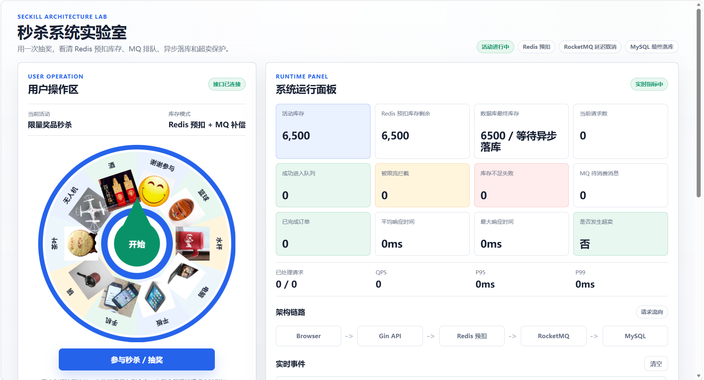
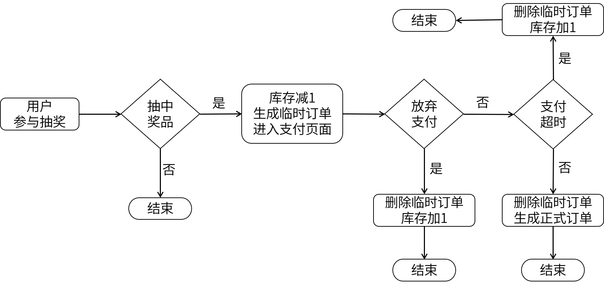

## 快速启动

项目默认采用“依赖跑 Docker，Go app 本机跑”的开发结构：

- Docker：MySQL、Redis、RocketMQ、wrk2 压测工具
- 本机：Go Web 进程

启动依赖：

```powershell
.\scripts\start-infra.ps1
```

启动 Go app：

```powershell
.\scripts\run-local-app.ps1
```

访问页面：

```text
http://localhost:5678/
```

本机压测：

```powershell
.\scripts\run-local-loadtest.ps1 -Rate 500 -Duration 30s -Connections 128
```

停止依赖：

```powershell
.\scripts\stop-infra.ps1
```

## 代码分层

后端代码按 Go 项目常见边界收进 `internal`，入口文件只负责启动应用：

```text
main.go                 # 程序入口，只调用 app.New().Run()
internal/app            # 组装日志、数据库、Redis、MQ、HTTP Server 和优雅退出
internal/router         # Gin 路由、静态资源、页面入口注册
internal/handler        # HTTP 入参/出参、Cookie、状态码和错误响应
internal/service        # 抽奖、支付、放弃支付等业务流程
internal/database       # MySQL / Redis 数据访问
internal/mq             # RocketMQ producer / consumer
internal/metrics        # 秒杀指标采集和快照
internal/util           # 配置、日志、抽奖算法和环境变量工具
```

## 建表
```sql
set names utf8mb4 collate utf8mb4_unicode_ci;

create database lottery;
grant all on lottery.* to tester;
use lottery;

create table if not exists inventory(
    id int auto_increment comment '奖品id，自增',
    name varchar(20) not null comment '奖品名称',
    description varchar(100) not null default '' comment '奖品描述',
    picture varchar(200) not null default '' comment '奖品图片',
    price int not null default 0 comment '价值',
    count int not null default 0 comment '库存量',
    primary key (id)
)default charset=utf8mb4 comment '奖品库存表，所有奖品在一次活动中要全部发出去';

insert into inventory (id,name,picture,price,count) values (1,'谢谢参与','img/face.png',0,1000);    --'谢谢参与'的id我要显式指定，因为go代码里我要写死这个id
insert into inventory (name,picture,price,count) values 
('篮球','img/ball.jpeg',100,1000),
('水杯','img/cup.jpeg',80,1000),
('电脑','img/laptop.jpeg',6000,200),
('平板','img/pad.jpg',4000,300),
('手机','img/phone.jpeg',5000,400),
('锅','img/pot.jpeg',120,1000),
('茶叶','img/tea.jpeg',90,1000),
('无人机','img/uav.jpeg',400,100),
('酒','img/wine.jpeg',160,500);

create table if not exists orders(
    id int auto_increment comment '订单id，自增',
    gift_id int not null comment '商品id',
    user_id int not null comment '用户id',
    count int not null default 1 comment '购买数量',
    create_time datetime default current_timestamp comment '订单创建时间',
    primary key (id),
    key idx_user (user_id)
)default charset=utf8mb4 comment '订单表';
```  

- 为了方便进行压力测试，我故意把库存量（count）设得很大，实际中可以把库存量设得很小。
- 指定一个特殊的id来标识“谢谢参与”，通过调节“谢谢参与”的count来控制它被抽中的概率。

## 业务流程


## 程序流程


## 高并发抽奖算法
假设有3件奖品，库存分别是5、2、4，要把这么奖品全部发出去。  
1. 根据当前的剩余库存计算每个奖品被抽中的概率。probs=(0.45, 0.18, 0.36)
2. 计算累积概率。acc=(0.45, 0.64, 1.0)，把线段[0,1]切分成三段
3. 生成(0,1]上的随机浮点数，落在哪一段上就抽中哪个奖品
4. 抽中一个奖品对应的库存减1  

每次抽奖都要重新走上面4步。
读库存和减库存都涉及到DB的操作，在大数据、高并发场景下(比如支付宝在春晚搞抽奖活动)Redis能承受的QPS比Mysql高一到两个数量级，所以实时库存放到Redis上去维护。
库存量很低的时候考虑一个极端情况：奖品还剩1件库存，2个协程同时去读这个库存，发现还剩1件，刚好又都抽中了这个奖品，于是2个协程同时去减1，还好Redis的Decr是原子操作。减1后如果发现库存为负数，则说明减库存失败，失败则需要重新走一遍抽奖算法。所以只有当减库存成功后才能给前端返回抽奖的结果，跟秒杀场景是一个道理。  

## 后端接口
|请求路径|请求方式|请求参数|说明|
| :--- | :--- | :--- | :--- |
|/|GET||返回抽奖转盘页面|
|/gifts|GET||返回所有奖品的详细信息，用于往转盘里填充内容|
|/lucky|GET||返回抽中的奖品ID|  
|/giveup|POST|uid和gid|不支付，放弃这次抽中的机会|  
|/pay|POST|uid和gid|完成支付|  
|/result|GET||抽奖成功页面|  
|/api/metrics/snapshot|GET||返回当前秒杀指标快照|
|/api/metrics/stream|GET||通过 SSE 实时推送秒杀指标|

## 前端展现
直接使用[lucky-canvas](https://100px.net/usage/js.html)抽奖插件。

## 依赖容器 + 本机 Go

项目的默认运行方式是：Docker 只启动 MySQL、Redis、RocketMQ NameServer、Broker、Proxy，并自动初始化 `lottery` 数据库和 `CANCEL_ORDER` 延时消息 Topic；Go app 在本机直接运行。

启动依赖容器：

```powershell
docker compose up -d
```

或使用脚本等待依赖就绪：

```powershell
.\scripts\start-infra.ps1
```

启动本机 Go app：

```powershell
.\scripts\run-local-app.ps1
```

启动后访问：

```text
http://localhost:5678/
```

常用命令：

```powershell
docker compose ps
docker compose logs -f rocketmq-broker
docker compose down
docker compose down -v
```

注意：`docker compose down -v` 会删除 MySQL、Redis、RocketMQ 的数据卷，下一次启动会重新执行 `init.sql`。

## wrk2 固定 QPS 压测

项目内置了 `wrk2` 压测容器，用于演示固定流量进入秒杀接口时，Redis 预扣库存和 RocketMQ 延时取消如何保护系统。

先启动依赖容器和本机 Go app：

```powershell
.\scripts\run-local-app.ps1
```

默认以 500 QPS 压测 `/lucky` 30 秒：

```powershell
docker compose --profile loadtest run --rm wrk2
```

调整压测参数：

```powershell
docker compose --profile loadtest run --rm `
  -e RATE=1000 `
  -e DURATION=60s `
  -e THREADS=4 `
  -e CONNECTIONS=256 `
  wrk2
```

`wrk2` 会通过 Lua 脚本给每个请求追加不同的 `uid`，实际请求形如：

```text
GET /lucky?uid=123456000001
```

压测结果中的 `Requests/sec`、延迟分布和错误数用于观察外部压力；页面右侧会通过 SSE 实时展示服务端埋点，包括限流数、库存不足数、MQ 待消费数、是否超卖等业务指标。

注意：官方 `giltene/wrk2` 依赖的老 LuaJIT 对 arm64 支持不好，项目中的 Dockerfile 默认使用 `AmpereTravis/wrk2-aarch64` fork，方便 Apple Silicon 机器原生构建和运行。

页面会通过 SSE 订阅实时指标：

```text
GET /api/metrics/stream
```

也可以直接查看当前快照：

```text
GET /api/metrics/snapshot
```

本机 Go app 主要通过环境变量覆盖默认配置：

|变量|默认值|说明|
| :--- | :--- | :--- |
|`LOTTERY_HTTP_ADDR`|`localhost:5678`|Web 监听地址|
|`LOTTERY_MYSQL_HOST`|`conf/mysql.yaml` 中的 host|MySQL 主机|
|`LOTTERY_MYSQL_PORT`|`conf/mysql.yaml` 中的 port|MySQL 端口|
|`LOTTERY_MYSQL_USER`|`conf/mysql.yaml` 中的 user|MySQL 用户|
|`LOTTERY_MYSQL_PASSWORD`|`conf/mysql.yaml` 中的 pass|MySQL 密码|
|`LOTTERY_MYSQL_DATABASE`|`lottery`|MySQL 数据库名|
|`LOTTERY_REDIS_ADDR`|`conf/redis.yaml` 中的 addr|Redis 地址|
|`LOTTERY_REDIS_PASSWORD`|`conf/redis.yaml` 中的 pass|Redis 密码|
|`LOTTERY_REDIS_DB`|`conf/redis.yaml` 中的 db|Redis DB|
|`LOTTERY_MQ_ENABLED`|`true`|是否启用 RocketMQ 延时取消订单|
|`LOTTERY_MQ_ENDPOINT`|`localhost:8081`|RocketMQ Proxy Endpoint|
|`LOTTERY_MQ_TOPIC`|`CANCEL_ORDER`|取消订单消息 Topic|
|`LOTTERY_MQ_CONSUMER_GROUP`|`lottery`|消费者组|
|`LOTTERY_COOKIE_DOMAIN`|`localhost`|Cookie 域名|
|`LOTTERY_RATE_LIMIT_QPS`|`0`|`/lucky` 固定窗口限流阈值，`0` 表示关闭；本机脚本默认设置为 `800`|
