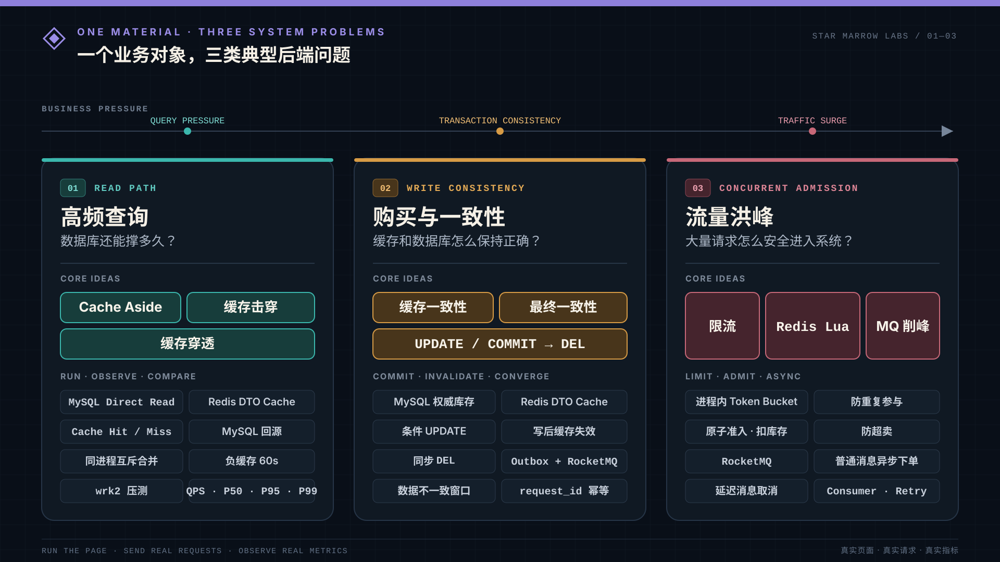
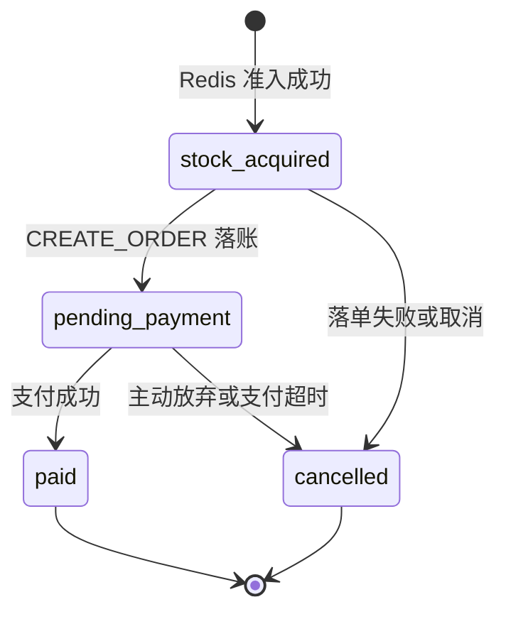

# Silas · 星髓高并发架构实验场

Silas 是一个 Go 高并发实验项目。它不按“章节”顺序解锁功能，而是围绕唯一业务材料“星髓”，平级提供三个可以独立进入的真实实验：

| 实验 | 核心问题 | 主要对比或结论 | 入口 |
|---|---|---|---|
| 旁路缓存查询 | 高频重复读如何离开 MySQL 热路径 | MySQL Direct vs Redis Cache-Aside；热点击穿；缓存穿透与负缓存 | `/material-shop?experiment=query` |
| 库存一致性购买 | MySQL 库存提交后，Redis 副本如何失效 | 同步 `DEL` vs Transactional Outbox + RocketMQ | `/material-shop?experiment=purchase` |
| 秒杀交易 | 高并发下如何裁决资格、削峰落单并收敛订单状态 | 令牌桶、Redis Lua、普通/延迟消息、支付与取消互斥 | `/seckill-lab` |

三项实验没有前置关系，也不需要按编号完成。编号只用于页面排列。

它们共享同一套 Go、MySQL、Redis、RocketMQ 和指标基础设施，但数据边界不同：

- 查询与购买实验共享 `materials.stock` 和 `archive:material-detail:v2:4`，用于真实展示写后缓存一致性，因此不应并行运行。
- 秒杀实验使用独立的 `inventory.count` 活动库存和 Redis admission，不与普通购买库存混用。
- 所有页面动画都由真实 HTTP 响应、Runner 事件或服务端 SSE 指标驱动，不生成假流量和假指标。

## 实验 × 知识点地图



## 快速开始

### 完整 Docker Compose

推荐使用完整 Compose，它会同时启动应用、受控压测 Runner 和全部依赖：

```bash
docker compose up -d --build
docker compose ps
```

打开：

```text
http://localhost:5678/
```

主要服务：

| 服务 | 用途 | 宿主机端口 |
|---|---|---:|
| `app` | Go Web、三个实验 API、SSE | `5678` |
| `loadtest-runner` | 管理白名单压测任务并启动 wrk2 | 不暴露 |
| `mysql` | 权威数据、订单账本、Outbox | `3306` |
| `redis` | DTO 缓存、秒杀库存和 admission | `6379` |
| `rocketmq-namesrv` | RocketMQ NameServer | `9876` |
| `rocketmq-broker` | Broker + Proxy | `8080/8081/10909/10911/10912` |
| `rocketmq-init` | 创建 Topic 和 Consumer Group，成功后退出 | — |

停止容器但保留数据卷：

```bash
docker compose down
```

### Windows 本机运行 Go

适合频繁修改 Go 代码：

```powershell
.\scripts\run-local-app.ps1
```

脚本会先启动 MySQL、Redis、RocketMQ 和初始化任务，再在宿主机运行应用：

```text
http://localhost:5678/
```

停止依赖：

```powershell
.\scripts\stop-infra.ps1
```

该模式默认不启动常驻 `loadtest-runner`。需要直接压测本机 `/lucky` 时可运行：

```powershell
.\scripts\run-local-loadtest.ps1 -Rate 500 -Duration 30s -Connections 128
```

页面内创建受控 Runner 任务的完整体验请使用完整 Compose。

## 实验一：旁路缓存查询

配置入口：`/material-shop?experiment=query`

实验室：`/lab`

同一份星髓聚合详情分别走两条路径：

```text
MySQL Direct
Browser / wrk2 -> Go API -> MySQL -> MaterialDetailDTO

Redis Cache-Aside
Browser / wrk2 -> Go API -> Redis
                            ├─ HIT  -> MaterialDetailDTO
                            └─ MISS -> MySQL -> SET DTO -> MaterialDetailDTO
```

聚合详情的 MySQL 权威数据来自：

- `materials`：材料基础信息和普通购买库存；
- `material_components JOIN materials`：组成材料；
- `trades`：交易次数、均价和最高价；
- `reviews`：评分和评价数。

Direct 每次通过 4 条 SQL 组装 DTO；Cache-Aside 直接缓存最终 DTO：

```text
key: archive:material-detail:v2:{id}
TTL: 5m
当前公开材料 ID: 4
```

查询实验包含三个阶段：

| 阶段 | 实际动作 | 观察重点 |
|---|---|---|
| 稳态性能 | 分别运行 Direct 和 Cache-Aside | 实际 QPS、SQL 次数、缓存命中、连接池、两类延迟 |
| 热点击穿 | 热 Key 稳态运行后执行真实 Redis `DEL`，继续观察重建与恢复 | MISS 波、MySQL 回源、同进程互斥合并、重建和稳定窗口 |
| 缓存穿透 | 持续请求固定不存在 ID `900004` | 无保护 vs 60 秒负缓存、无效 MySQL 查询和负缓存命中 |

稳态阶段公开的 Runner 参数：

| 目标速率 | 固定时长 |
|---:|---:|
| 100 req/s | 30s |
| 300 req/s | 30s |
| 800 req/s | 30s |
| 1500 req/s | 30s |

连接模式可以自动估算，也可以手动选择 `70 / 140 / 300 / 500`。自动模式根据同一材料的历史实际请求 P95 估算在途请求数，并让 Direct 与 Cache-Aside 在相同目标速率下复用同一配置。热点击穿和缓存穿透使用 Runner 控制的自动连接配置。

`wrk2 -c N` 是配置的 HTTP 持久连接数，不表示已经成功建立 N 个 Socket；建连情况需要结合 Socket Errors 判断。

详情接口通过响应头暴露真实路径证据：

```text
X-Read-Path: mysql-direct | cache-aside
X-Archive-Source: mysql | redis-miss | redis-hit | redis-fallback
X-SQL-Queries: 0 | 1..4
```

缓存穿透的内部 Runner 接口还会返回 `redis-negative-hit`，用于证明请求命中了负缓存而没有再次查询 MySQL。

同进程冷缓存并发使用双检互斥合并回源。它只约束当前进程，不等价于多实例分布式锁。Redis 故障时查询降级到 MySQL，因为缓存是性能层，不是正确性依赖。

## 实验二：库存一致性购买

配置入口：`/material-shop?experiment=purchase`

实验室：`/purchase-lab`

每轮实验固定：

- 将星髓 `materials.stock` 重置为 `100`；
- 发送 `150` 个唯一 `request_id`，每个购买 1 件；
- 最多 `12` 个购买并发槽持续推进事务；
- 页面以 `20 QPS` 调用真实 Cached 查询，观察旧库存读取窗口；
- 正常结果为 100 次成功、50 次售罄，且最终 MySQL 库存为 0。

### 方案 A：同步删除缓存

```text
HTTP request
-> MySQL transaction
   -> UPDATE materials SET stock = stock - 1 WHERE stock >= 1
   -> INSERT purchase_lab_orders(request_id UNIQUE)
-> COMMIT
-> Redis DEL archive:material-detail:v2:{materialId}
-> response
```

缓存删除位于请求链内，结构简单、旧读窗口短，但 Redis 延迟或失败会直接延长或影响购买响应。订单和库存已经提交时，相同 `request_id` 的重试不会再次扣库存，只会重试失效缓存。

### 方案 B：Transactional Outbox + MQ

```text
HTTP request
-> MySQL transaction
   -> 条件扣减 materials.stock
   -> INSERT purchase_lab_orders
   -> INSERT purchase_lab_outbox
-> COMMIT / response

Outbox Worker（每 1 秒扫描）
-> claim event
-> publish PURCHASE_CACHE_INVALIDATE
-> mark published

缓存失效 Consumer
-> validate event_id + material_id
-> Redis DEL
-> mark completed
-> Ack
```

订单、库存和 Outbox 在同一事务提交，避免“数据库已提交但事件尚未记录”。异步方案缩短购买响应路径，但会产生可观测的最终一致性窗口，并引入 Worker、MQ、幂等消费和重试复杂度。

`request_id`、`event_id` 都有唯一约束。重复消息再次执行 `DEL` 是幂等操作；Redis 删除或状态写回失败时 Consumer 不 Ack，依赖 RocketMQ 重投。

页面保存本轮 trace、Outbox 时间、Publisher 扫描时钟和一致性探针样本，用于纯前端回放。回放不会重新购买、重置库存或发送 MQ。

## 实验三：秒杀交易

入口：`/seckill-lab`

秒杀页把不同结论拆成三个独立场景，避免用一轮混合流量同时证明所有事情：

| 场景 | 负载 | 验证目标 |
|---|---|---|
| 单次链路 | 浏览器发起一次真实 `/lucky` | 看清限流、Lua、MQ、MySQL 和订单状态的先后关系 |
| 库存争抢 | 600 个唯一用户同时争抢 300 份星髓 | 300 准入、300 售罄、0 超卖；默认满桶 800 内不应触发限流 |
| 入口限流 | 300 / 800 / 1500 req/s，各运行 10 秒 | 单独观察共享令牌桶的 204 放行和 429 拒绝，不访问库存、MQ 或 MySQL |

当前公开写入口只保留 Redis 准入模式：

```text
GET /lucky
-> 本进程令牌桶
-> Redis Lua：防重 + 检查库存 + 扣库存 + 写 stock_acquired
-> CANCEL_ORDER 延迟消息：支付窗口到期检查
-> CREATE_ORDER 普通消息：异步建立 MySQL pending_payment 账本
-> POST /pay 或 POST /giveup
```

订单生命周期：


```mermaid
stateDiagram-v2
    [*] --> stock_acquired: Redis 准入成功
    stock_acquired --> pending_payment: CREATE_ORDER 落账
    stock_acquired --> cancelled: 落单失败或取消
    pending_payment --> paid: 支付成功
    pending_payment --> cancelled: 主动放弃或支付超时
    paid --> [*]
    cancelled --> [*]
```

`paid` 和 `cancelled` 是互斥终态。支付与取消竞争同一个 Redis admission 状态，只有第一次合法迁移生效；取消路径只回补一次库存，重复消息和重复请求只能做幂等读取。

Redis Lua 原子边界：

| 动作 | 合法状态变化 | 关键保证 |
|---|---|---|
| `TryAcquire` | 无状态 → `stock_acquired` | 防重、查库存、扣库存和写 admission 原子完成 |
| `MarkPending` | `stock_acquired` → `pending_payment` | 重复落单幂等，终态不可倒退 |
| `ClaimLottery` | `pending_payment` → `paid` | 重复支付幂等，取消后不可复活 |
| `ReleaseLottery` | 非终态 → `cancelled` | 只回补一次，支付后不可取消 |

支付窗口为 600 秒；admission TTL 比支付窗口额外保留 3600 秒。TTL 只清理残留状态，不会自动回补库存，真正释放必须经过取消 Lua。

历史数据卷中已经存在的 MySQL 模式订单仍可支付或取消，但 `GET /lucky/cacheaside` 已取消注册，不再创建新的 MySQL 同步准入订单。旧 `/api/archives` 和 `/gifts` 入口同样已移除。

## Runner 与真实指标

`loadtest-runner` 是 Compose 网络内的常驻 HTTP 服务。浏览器只提交有限白名单参数，不能传入任意目标 URL、Lua 路径、线程、时长或命令。

Runner 当前支持：

- `cache-aside-read`
- `cache-breakdown`
- `cache-penetration`
- `seckill-stock-burst`
- `seckill-rate-limit`

全局同时只允许一个 Runner 任务。任务状态机：

```text
starting -> resetting -> running -> collecting -> completed
                   \-> stopped
任意活动状态 -------> failed
```

任务创建、GET 快照、轮询和任务 SSE 采用单调状态合并；浏览器关闭或 SSE 断线不会停止任务，只有显式调用 stop API 才会回收 wrk2 子进程。任务快照和有限事件历史保存在 `loadtest-runner-data` 卷中，Runner 重启会把遗留活动任务标记为失败并释放全局锁。

指标区分两类延迟：

- `requestP*Ms`：uncorrected histogram，请求真正发出到收到响应的实际请求延迟；
- `p*Ms`：coordinated-omission corrected histogram，从计划投递时刻开始，包含连接不足或响应过慢形成的需求侧欠账。

corrected 延迟不能称为“客户真实等待时间”。仓库内的 wrk2 补丁使用单调时钟，并记录 `latencyScheduleFallbacks` 与 `latencySamplesDropped`，避免非法样本触发 HDR Histogram 断言。

全局指标由：

```text
GET /api/metrics/snapshot
GET /api/metrics/stream
```

提供。SSE 是页面实时展示的权威数据源；指标使用有界样本，GORM 默认只记录慢查询和错误，避免压测日志本身成为瓶颈。

## RocketMQ 消息

| Topic | 类型 | 职责 | Consumer Group |
|---|---|---|---|
| `CREATE_ORDER` | 普通消息 | Redis 准入后异步建立 MySQL 待支付订单 | `lottery` |
| `CANCEL_ORDER` | 延迟消息 | 支付窗口到期后检查并取消非终态订单 | `lottery` |
| `PURCHASE_CACHE_INVALIDATE` | 普通消息 | 购买实验异步失效材料 DTO 缓存 | `lottery-purchase-cache` |

订单 Consumer 与缓存失效 Consumer 的订阅集合不同，因此必须使用不同 Consumer Group。Topic 是消息分类，不等于 Consumer，也不等于单条物理队列。

消费原则：解析、数据库、Redis 或状态机处理失败时不 Ack；幂等处理成功后才 Ack。RocketMQ 可能重复投递，正确性依赖唯一键、条件更新、Lua 状态机和幂等 `DEL`，不能依赖“消息只来一次”。

## 页面与 API

页面路由：

| 路径 | 用途 |
|---|---|
| `/` | 三个平级实验的总览 |
| `/material-shop?experiment=query` | 查询实验详情页 |
| `/lab` | 查询实验室 |
| `/material-shop?experiment=purchase` | 购买实验详情页 |
| `/purchase-lab` | 购买实验室 |
| `/seckill-lab` | 秒杀实验室 |
| `/result` | 秒杀订单支付/取消页 |

`/material-shop` 只接受 `experiment=query` 或 `experiment=purchase`；缺少参数或参数非法时会重定向到 `/`，不会进入额外的“章节”或前厅页面。

公开 API：

| 方法 | 路径 | 用途 |
|---|---|---|
| GET | `/api/archives/:id/direct` | MySQL Direct 聚合详情 |
| GET | `/api/archives/:id/cached` | Redis Cache-Aside 聚合详情 |
| POST | `/api/chapters/cache-aside/reset` | 清理查询缓存和指标；路径名为历史兼容保留 |
| GET | `/api/purchase-lab/:id/state` | 读取购买实验 MySQL/Redis 库存 |
| POST | `/api/purchase-lab/:id/reset` | 重置购买基线并预热 DTO |
| POST | `/api/purchase-lab/:id/run` | 运行同步失效或 Outbox + MQ 购买实验 |
| POST | `/api/purchase-lab/:id/query` | 读取 1～20 个真实 Cached 查询样本 |
| GET | `/api/purchase-lab/runs/:requestId` | 查询批次、订单和 Outbox 状态 |
| GET | `/api/seckill/materials` | 读取秒杀材料目录，不返回实时库存 |
| GET | `/api/seckill/rate-limit-probe` | 只经过秒杀令牌桶的隔离探针 |
| GET | `/lucky` | 秒杀准入 |
| GET | `/api/order/status` | 查询订单或 admission 状态 |
| POST | `/pay` | 支付订单 |
| POST | `/giveup` | 主动放弃支付 |
| POST | `/api/lab/reset` | 重置完整秒杀实验 |
| GET | `/api/metrics/snapshot` | 获取指标快照 |
| GET | `/api/metrics/stream` | 订阅指标 SSE |
| POST | `/api/loadtests/connection-plan` | 只读预估 wrk2 连接配置 |
| POST | `/api/loadtests` | 创建白名单 Runner 任务 |
| GET | `/api/loadtests/:id` | 获取任务权威快照 |
| GET | `/api/loadtests/:id/events` | 订阅任务 SSE 和历史回放 |
| POST | `/api/loadtests/:id/stop` | 停止任务并回收子进程 |

`/internal/cache-experiments/*` 只供 Runner 控制热点击穿和缓存穿透场景，使用任务令牌校验，不是浏览器通用业务 API。

## 代码结构

```text
main.go                     极薄进程入口
internal/app                依赖装配、后台任务、HTTP 启动与优雅退出
internal/router             页面、静态资源和 API 路由
internal/handler            HTTP 入参、响应、Cookie、错误码和状态码
internal/service            查询、购买、秒杀、支付、取消和实验编排
internal/database           MySQL / Redis 访问、事务、缓存和 Redis Lua
internal/mq                 Producer、两个 Consumer、Topic 与 Group 配置
internal/metrics            有界指标、快照和 SSE 数据源
internal/loadtest           Runner 状态机、白名单、进程控制和结果解析
internal/util               环境变量、日志和通用工具
cmd/loadtest-runner         常驻 Runner 进程入口
views/html                  三个实验及支付页面
views/css                   页面样式
views/js                    页面状态、真实请求、SSE 和结果回放
docker/wrk2                 跨架构 wrk2、补丁、Runner 镜像和 Lua 脚本
docker/rocketmq             RocketMQ Broker 配置
scripts                     Windows 本地启动、停止和直接压测脚本
docs                        本地开发、可靠性边界和演示资料
```

## 配置

常用环境变量：

| 变量 | 默认值或 Compose 值 | 说明 |
|---|---|---|
| `LOTTERY_HTTP_ADDR` | `localhost:5678` | Web 监听地址 |
| `LOTTERY_MYSQL_*` | 见 `docker-compose.yml` | MySQL 连接信息 |
| `LOTTERY_REDIS_ADDR` | `redis:6379` | Redis 地址 |
| `LOTTERY_REDIS_DB` | `2` | Redis DB |
| `LOTTERY_MQ_ENABLED` | `true` | 是否启用 RocketMQ |
| `LOTTERY_MQ_ENDPOINT` | `rocketmq-broker:8081` | RocketMQ Proxy gRPC 地址 |
| `LOTTERY_RATE_LIMIT_QPS` | `800` | 本进程秒杀令牌桶速率，`0` 表示关闭 |
| `LOTTERY_CACHEASIDE_DB_CONCURRENCY` | `10` | 查询实验 MySQL 并发闸门 |
| `LOTTERY_LOADTEST_RUNNER_URL` | `http://loadtest-runner:8090` | 主应用访问 Runner 的内部地址 |
| `LOTTERY_LOG_LEVEL` | `info` | `slog` 日志级别 |

本地脚本设置 `COMPUTERNAME=itcheer`，用于规避 RocketMQ/gRPC 在中文主机名环境下的兼容问题，不要移除。

## 验证

```bash
go test ./...
go vet ./...
docker compose config --quiet
```

只做 Go 包编译检查：

```bash
go test ./... -run '^$'
```

更多说明：

- `docs/local-dev.md`：本地开发方式；
- `docs/reliability.md`：状态机、一致性、MQ 和故障边界；
- `AGENTS.md`：维护约束和关键链路修改规则。

## 仍未达到生产级的边界

当前项目已经覆盖真实的原子准入、条件扣减、幂等消费、Outbox、延迟取消、状态机和 SSE 指标，但仍是单机演示架构：

1. 秒杀 Redis 准入成功后、第一条 MQ 消息发送前崩溃，仍需要可靠事件或扫描补偿。
2. Redis 终态推进成功但 MySQL 账本更新失败时依赖重试，尚缺自动对账和告警。
3. 支付接口没有接入外部支付流水、回调、退款和资金对账。
4. 令牌桶和查询回源互斥都是进程内机制，多实例需要全局限流和分布式协调。
5. MySQL、Redis、RocketMQ 均为本地单节点 Compose，没有生产级高可用和灾备。
