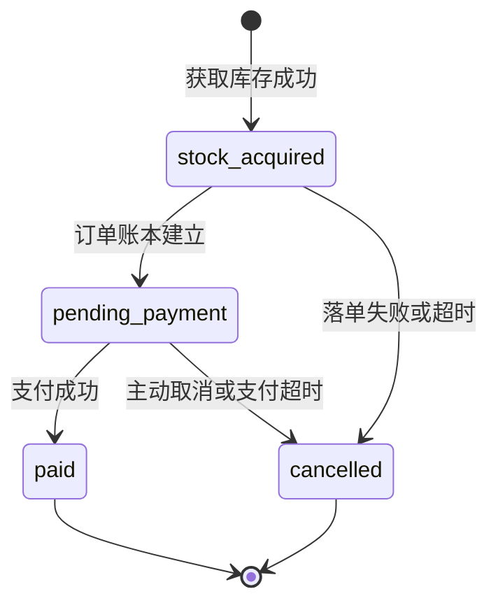

# Silas · 高并发架构故事书

这不是把 Redis、MySQL、RocketMQ 全部堆在一张图上的“技术陈列柜”。项目会像一本故事书一样，一章只提出一个问题，再用可重复的真实实验让架构自己回答。

当前街区包含三条彼此独立、但共享同一炼金材料世界观的实验链路：

- 左侧限量材料申领所：星髓抢购、入口限流、Redis Lua 原子准入、RocketMQ 异步落单与支付/取消状态机；
- 右侧材料查询实验：对比 MySQL Direct 与 Redis Cache-Aside；
- 右侧材料购买实验：对比同步缓存失效与 Outbox + MQ 异步失效。

首页不再按街道建筑划分功能，而以唯一材料“星髓”为视觉中心，平级展示三个技术问题：
旁路缓存查询、库存一致性购买和秒杀交易。桌面端悬停或键盘聚焦方片可预览实验，点击名称可锁定展开；
触屏设备点击展开，再通过独立按钮进入。查询与购买仍进入 `/material-shop` 完成各自计划配置，
秒杀直接进入 `/seckill-lab`。三项实验共享业务语境，但各自拥有独立、可重置的数据边界。
秒杀页的材料目录不返回实时库存，避免展示数据被误当成 Redis 准入的权威结果。

左侧把三个问题明确隔离：单次请求只解释 `HTTP -> 限流 -> Redis Lua -> RocketMQ -> MySQL`；
库存主实验由 Runner 精确生成 600 个唯一用户同时争抢 300 份星髓，批次小于默认 800 的满桶容量，
因此正常结果应是 0 个限流、300 个准入、300 个售罄且不超卖；限流辅助实验则使用与 `/lucky`
共享的令牌桶探针持续运行 10 秒，探针通过后立即返回，不访问库存、MQ 或 MySQL。

室外街道、店铺轮廓和远景统一由 `views/img/market-street-bg.svg` 提供；热区、槽口、
剪影和粒子坐标集中在 `views/js/market-scene-config.js`。替换背景时只需重新标定这一份配置，
不要重新使用 CSS 几何块拼接街道。

## 第一章怎么玩

页面采用逐幕推进：后续章节入口默认锁定，必须先真正翻阅一页档案、让旧路径承受请求、再让缓存路径交出数据，故事才会继续。原生长滚动条被隐藏，页首进度与桌面端章节罗盘只负责标记已经走过的路，不能提前跳过实验。

启动完整环境：

```bash
docker compose up -d --build
```

打开：

```text
http://localhost:5678/
```

### Windows / macOS / Linux 压测兼容

`docker/wrk2/Dockerfile` 会读取 Docker BuildKit 提供的 `TARGETARCH`，不需要手动指定 `--platform`：

- `amd64`（常见 Windows、Intel Mac）构建 wrk2 主线版本；
- `arm64`（Apple Silicon Mac、Windows on ARM）构建 AArch64 兼容版本。

仓库通过 `.gitattributes` 强制 Shell 和 Lua 脚本使用 LF，避免 Windows 的 CRLF 让 Linux 容器入口启动失败。首次构建 wrk2 需要下载编译工具链；Dockerfile 会按 CPU 架构隔离 apt 缓存，并对镜像源的临时 5xx 和中断下载自动重试。

`docker compose up -d --build` 会同时启动不暴露宿主机端口的常驻
`loadtest-runner`。页面通过主应用创建受控任务，Runner 在 Compose 网络内启动 wrk2；
Windows、macOS 和 Linux 都只需配置“查询潮汐”并开始实验，不依赖宿主机终端语法。

然后按页面顺序完成四件事：

1. 首页的查询与购买方片分别进入 `/material-shop?experiment=query` 和 `/material-shop?experiment=purchase`。这个二级页是“星髓实验计划工作台”，材料店前厅已经删除；无实验参数或参数非法的 `/material-shop` 会返回实验总览。两项实验共享材料语境，但互不构成启动前置条件。由于共用库存与缓存，不应并行运行。组成材料只参与详情 JOIN，不作为独立商品开放。
2. 查询计划工作台直接选择 Direct / Cache-Aside、目标速率、连接策略和固定时长，右侧只展示本轮计划摘要与路径预览。配置页只显示 Runner 的启动前 `wrk2 -c` 预估并保存实验计划，不创建任务。进入 `/lab` 后，页面先完成可见场景渲染并收到指标 SSE 的首个权威快照，随后才调用 `/api/loadtests`；任务创建响应会立即显示本轮最终锁定的 `-c`。实验期间通过 SSE 观察服务端 SQL、连接池与缓存状态，最终对比表分别冻结目标/实际速率、目标完成率、`-c` 配置、实际请求延迟、需求侧延迟、Socket Errors 和 Error Rate。购买计划工作台选择同步失效或 Outbox + MQ，并明确展示固定的 150 个唯一请求、12 个服务端并发槽和 20 QPS 观察探针；确认后进入 `/purchase-lab`，仍由用户明确点击才开始真实执行。购买页在 POST 返回前轮询真实批次进度，始终保留完整流程骨架，只高亮当前真实节点；事务提交后才激活 `Outbox Publisher -> MQ(PURCHASE_CACHE_INVALIDATE) -> 缓存失效 Consumer -> Redis DEL` 支线。当前步骤用“发生 / 原因 / 证据 / 接下来”四块稳定讲解，实时计数不会反复换掉正文；真实执行结束后默认停在回放第 1 步，自动播放时 1x 每步停留 6 秒。Publisher 每 1 秒真实扫描一次，页面直接显示后端提供的扫描次数与上/下次扫描时间。
3. 唤醒 Redis 记忆水晶。第一次查询真实发生 `MISS -> 4 SQL -> SET DTO`，后续直接命中最终 JSON。
4. 切换 Cached 并使用相同查询潮汐与通路配置再次点击，查看缓存命中和 MySQL 回源差异。

查询潮汐表示 wrk2 每秒计划产生多少个 HTTP 请求，不表示同时在线的人数。页面提供四个
目标速率：

| Rate ID | 页面名称 | 目标速率 | 时长 |
|---|---|---:|---:|
| `qps_100` | 100 卷轴/秒 | 100 req/s | 30s |
| `qps_300` | 300 卷轴/秒 | 300 req/s | 30s |
| `qps_800` | 800 卷轴/秒 | 800 req/s | 30s |
| `qps_1500` | 1500 卷轴/秒 | 1500 req/s | 30s |

“魔法通路”对应 wrk2 的 HTTP 持久连接。自动模式会依据同一材料的历史实际请求 P95
估算所需在途请求数、增加周转余量，并从 70 / 140 / 300 / 500 条通路中选择；同一材料、
同一目标速率的另一读取路径会沿用已经选定的自动配置，避免 Direct 与 Cache-Aside 使用
不同并发条件。手动模式允许直接选择 70 / 140 / 300 / 500 条通路，用于观察固定通路数下
响应时间如何影响周转和入口积压。配置阶段的只读预估由
`POST /api/loadtests/connection-plan` 使用与任务创建相同的 Runner 算法给出；它不创建任务。
真正创建任务时 Runner 会再次计算并在响应中返回最终锁定的 `connections`。

计划工作台到实验室的视觉转场不承担启动语义。工作台只把路径、目标速率、连接模式和固定时长
保存到同标签页的待运行计划并写入 URL；实验室确认页面可见且全局指标 SSE 已收到首帧后，
才创建 Runner 任务。任务创建到任务 SSE 建立之间的少量事件由 Runner 事件历史回放，
完整状态仍由任务 GET 快照和轮询恢复，因此无需新增 prepared 状态或另一套启动接口。

页面中的 `wrk2 -c N` 表示传给 wrk2 的配置连接数，不是另行测得的“成功建立 N 个 TCP
Socket”。配置页尚未启动时，当前压测进程明确显示 0 条；任务创建后显示最终 `-c`，建连
异常仍需结合同一轮的 Socket Errors 判断。

一条 HTTP/1.1 持久连接可以连续复用，但当前 wrk2 链路通常要等上一张卷轴返回后才会在
同一连接上发送下一张。连接不足或响应过慢时，wrk2 无法按目标节奏及时投递的请求会形成
需求侧欠账；页面只在魔法通路入口表现这种积压，不能把它画成请求已经进入 MySQL 后等待。
场景中的少量法师或“法师公会”只代表请求来源，不与 QPS、连接数或请求数一一对应。

最终指标区明确区分两类延迟：`requestP50Ms` / `requestP90Ms` / `requestP95Ms` /
`requestP99Ms` 来自 wrk2 uncorrected histogram，表示请求真正发出到收到响应的时间；
`p50Ms` / `p90Ms` / `p95Ms` / `p99Ms` 来自 coordinated-omission corrected
histogram，表示从计划投递时刻到收到响应的需求侧延迟，包含未能及时发送形成的容量欠账。
后者不能标记为“客户真实等待时间”。购买实验的 150 个唯一购买请求是另一轮独立负载，
与查询潮汐、通路数量和 `actualRequests` 均无人数换算关系。

终端命令仍保留在“查看等价命令”折叠区，只用于学习和调试，不是正常操作路径。

重新讲述本章时，点击页脚的“合拢书本，重新讲述”。它只会清空：

- `archive:material-detail:v2:*` Redis 最终 DTO 缓存；
- 第一章的直读与缓存读指标。

它不会删除秒杀订单，也不会改动任何库存。

## 这次对比为什么成立

两轮实验固定：

| 不变量 | 内容 |
|---|---|
| 业务语义 | 读取同一份材料聚合详情 |
| 权威数据 | MySQL 材料基础、组成、交易与评分表 |
| HTTP 响应体 | 完全相同的 JSON |
| 压测工具 | wrk2 固定 QPS |
| 目标速率、时长、通路数 | 两条路径使用同一组配置；自动模式会为同组实验复用通路数 |

唯一变量是读取路径：

```text
旧规矩
Browser / wrk2 -> Go API -> MySQL

记忆水晶
Browser / wrk2 -> Go API -> Redis
                            ├─ HIT  -> 返回
                            └─ MISS -> MySQL -> 回填 Redis -> 返回
```

因此第一章没有再把 Cache-Aside 塞进秒杀库存方案里。缓存优化的是“它是什么”这类可重复读取；它不负责裁决“最后一件库存属于谁”。

## 真实指标与故事隐喻

页面没有伪造流量。故事中的每个变化都由服务端指标触发：

| 故事语言 | 技术指标 |
|---|---|
| 法师公会 | 请求来源或用户群体的场景角色，不映射具体数值 |
| 查询卷轴 | 一次 HTTP 请求 |
| 查询潮汐 | 目标速率，即每秒计划生成的查询卷轴数 |
| 魔法通路 | wrk2 `connections` / `-c` 配置，即计划保持的 HTTP 持久连接数；是否建连异常结合 Socket Errors |
| 通路占用时间 | `requestP*Ms`，请求发出到收到响应的实际请求延迟 |
| 实际处理速率 | wrk2 `actualQps`，即每秒完成的请求数 |
| 入口卷轴积压 | corrected 需求侧延迟和目标完成率共同揭示的投递欠账 |
| 真本查询次数 | MySQL `sqlQueries`（兼容字段 `dbReads` 同值） |
| 每秒问询 | 最近请求桶计算的 `qps` |
| 实际请求 P99 | wrk2 uncorrected `requestP99Ms` |
| 需求侧 P99 | wrk2 corrected `p99Ms`，包含未及时投递的容量欠账 |
| 长廊最高占用 | MySQL pool peak / capacity |
| 水晶回答 | Redis cache hit |
| 水晶遗忘 | Redis cache miss |
| 真本磨损、书脊裂开 | 由真实 MySQL 读取次数跨过阈值后触发的叙事表现 |

指标只保留有界延迟样本，不逐请求写日志。GORM 默认只记录慢查询和错误，避免压测再次制造 GB 级 SQL 日志。

## 第一章 API

| 路径 | 方法 | 说明 |
|---|---|---|
| `/api/archives` | GET | 材料基础列表；不计入对比指标 |
| `/api/archives/:id/direct` | GET | 每次执行 4 条 SQL 组装聚合详情 |
| `/api/archives/:id/cached` | GET | Redis Cache-Aside 读取最终 DTO |
| `/api/chapters/cache-aside/reset` | POST | 清缓存并重置本章指标 |
| `/api/metrics/snapshot` | GET | 全部服务端指标快照，含 `archiveRead` |
| `/api/metrics/stream` | GET | SSE 实时指标流 |
| `/api/loadtests` | POST | 创建白名单压测任务；已有活动任务时返回 `409 LOADTEST_ALREADY_RUNNING` |
| `/api/loadtests/:id` | GET | 查询任务状态、时间、日志和最终指标 |
| `/api/loadtests/:id/events` | GET | 任务 SSE：进度、指标、日志和终态 |
| `/api/loadtests/:id/stop` | POST | 停止任务并回收 wrk2 子进程 |
| `/api/seckill/rate-limit-probe` | GET | 共享 `/lucky` 令牌桶的隔离探针；204 放行，429 限流，不进入业务链路 |
| `/api/purchase-lab/:id/state` | GET | 读取购买实验共享的 MySQL / Redis 库存 |
| `/api/purchase-lab/:id/reset` | POST | 重置 `materials.stock` 并重新预热材料 DTO |
| `/api/purchase-lab/:id/run` | POST | 执行同步失效或 Outbox + MQ 购买实验，最多 150 个唯一请求 |
| `/api/purchase-lab/:id/query` | POST | 执行 1～20 次真实 Cached 查询采样 |
| `/api/purchase-lab/runs/:requestId` | GET | 查询订单、Outbox、MQ 和缓存失效状态 |

两条详情接口的响应体相同，只通过响应头解释数据来源：

```text
X-Read-Path: mysql-direct | cache-aside
X-Archive-Source: mysql | redis-miss | redis-hit | redis-fallback
X-SQL-Queries: 0 | 1..4
```

缓存 key 与边界：

```text
key: archive:material-detail:v2:{id}
TTL: 300s
权威源: MySQL materials / material_components / trades / reviews
```

同进程冷启动并发通过双检互斥合并回源，避免第一波 MISS 放大成缓存击穿。Redis 故障时请求降级回源 MySQL：缓存可以失去，真本不能失去。

实验页的弱入口“查看数据构成”只展开一张整体映射：`materials` 提供基础信息，
`material_components + materials` JOIN 组成材料，`trades` 执行 `COUNT / AVG / MAX`，
`reviews` 执行 `AVG / COUNT`，最后组装为 Redis 直接缓存的 `MaterialDetailDTO`。

## 书页背后的完整项目

第一章之外，后端仍保留两套统一订单生命周期的秒杀写路径，供后续章节逐步揭示：

- **方案 A：MySQL 权威库存同步准入**；
- **方案 B：Redis 原子准入 + RocketMQ 普通消息异步落单 + MySQL 最终账本**。

统一生命周期：


```mermaid
stateDiagram-v2
    [*] --> stock_acquired: 获取库存成功
    stock_acquired --> pending_payment: 订单账本建立
    stock_acquired --> cancelled: 落单失败或超时
    pending_payment --> paid: 支付成功
    pending_payment --> cancelled: 主动取消或支付超时
    paid --> [*]
    cancelled --> [*]
```

两个写模式的当前 API：

| 路径 | 方案 |
|---|---|
| `GET /api/seckill/materials` | 当前唯一限量材料“星髓”；不返回实时库存 |
| `GET /lucky/cacheaside` | 历史路径名；实际是 MySQL 权威库存同步扣减 |
| `GET /lucky` | Redis Lua 准入 + RocketMQ 异步落单 |
| `GET /api/order/status` | 查询统一订单状态 |
| `POST /pay` | `pending_payment -> paid` |
| `POST /giveup` | 非终态 `-> cancelled` |
| `POST /api/lab/reset` | 重置完整秒杀实验 |

`/lucky/cacheaside` 会在后续章节改成语义清楚的新路径；当前保留它是为了不破坏已有调用。它不再出现在第一章页面，也不再被解释成“缓存库存方案”。

## RocketMQ Topics

| Topic | 类型 | 职责 | 处理者 |
|---|---|---|---|
| `CREATE_ORDER` | 普通消息 | Redis 准入后异步创建 MySQL 待支付订单，缓冲数据库写峰值 | 订单 Consumer（group `lottery`） |
| `CANCEL_ORDER` | 延迟消息 | 支付窗口到期后触发状态检查和库存释放 | 订单 Consumer（group `lottery`） |
| `PURCHASE_CACHE_INVALIDATE` | 普通消息 | 发布购买实验的材料 DTO 缓存失效事件；幂等执行 DEL | 缓存失效 Consumer（group `lottery-purchase-cache`） |

Topic 是消息类别，像信箱，不等于 Consumer，也不等于一条物理队列。当前三个 Topic 由两个独立“办事员”处理：订单 Consumer 负责创建和取消订单，缓存失效 Consumer 只负责删缓存；一个 Topic 内部还可以有多个 MessageQueue 分区。

普通消息使用的是主流 MQ 共有的异步解耦、缓冲削峰和至少一次投递语义；延迟取消才使用 RocketMQ 的延迟消息能力。

## 章节路线

```text
第一章  被查询卷轴翻热的材料档案
        Cache-Aside：重复读如何离开 MySQL 热路径

第二章  当一千只手伸向最后一枚星印
        MySQL 条件扣减：权威库存如何同步裁决

第三章  城门只发放资格，不再当场誊写订单
        Redis Lua + MQ：准入、削峰、异步落单

第四章  两封迟到的信与一份不能复活的订单
        至少一次投递、幂等、超时取消与状态机
```

## 代码结构

```text
internal/app            依赖装配、启动和优雅退出
internal/router         页面与 API 路由
internal/handler        HTTP 协议适配
internal/service        读取编排、抽奖、支付和取消业务流程
internal/database       MySQL / Redis 数据访问与 Lua 原子脚本
internal/mq             RocketMQ producer / consumer
internal/metrics        有界内存指标、快照与 SSE 数据源
internal/loadtest       Runner 状态机、白名单、进程控制、解析器与内部客户端
cmd/loadtest-runner     常驻 Runner HTTP 进程入口
views/                  故事书页面与支付页
docker/wrk2             跨架构 wrk2、Runner 镜像目标和 Lua 请求脚本
docs/                   状态机与可靠性边界
```

## 验证

```bash
go test ./...
go vet ./...
docker compose config --quiet
```

订单和消息可靠性边界详见 [docs/reliability.md](docs/reliability.md)。
